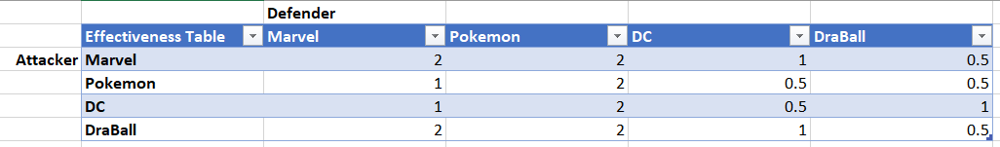
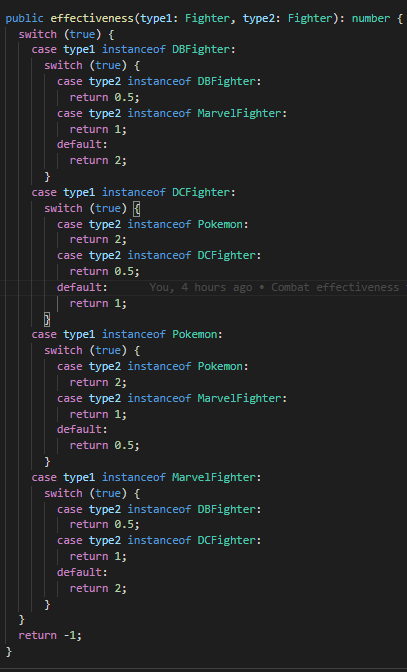
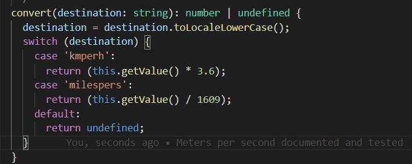
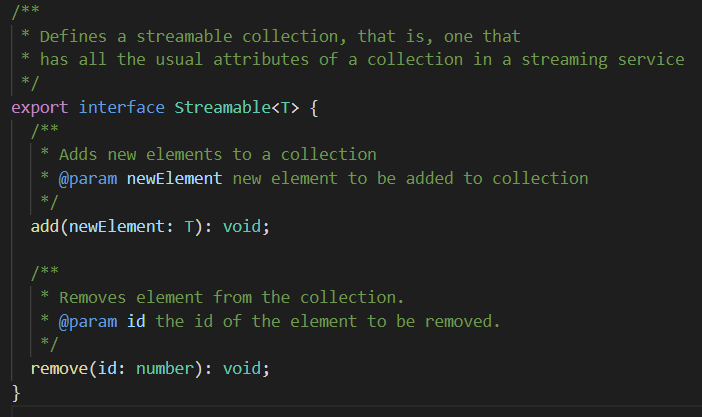
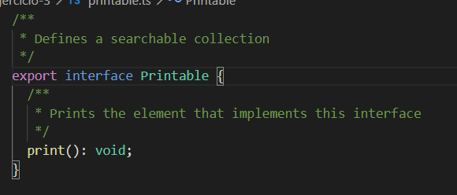
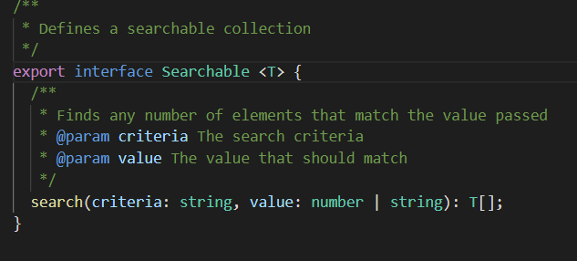
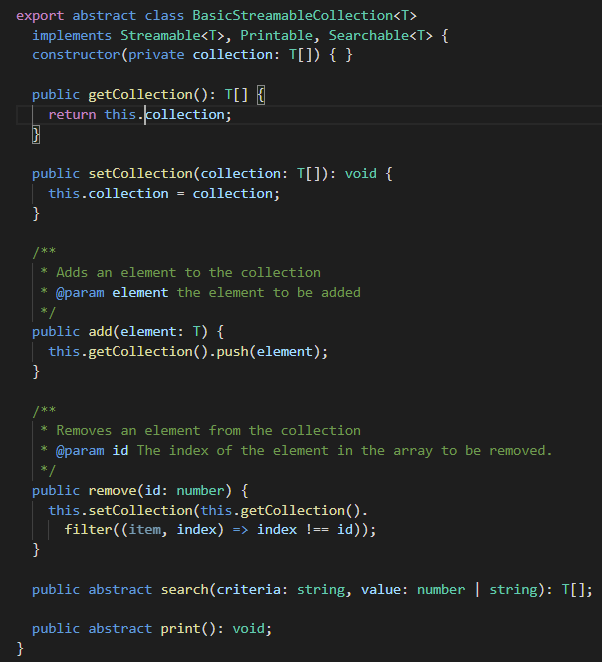
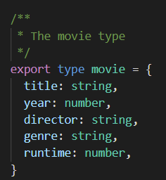
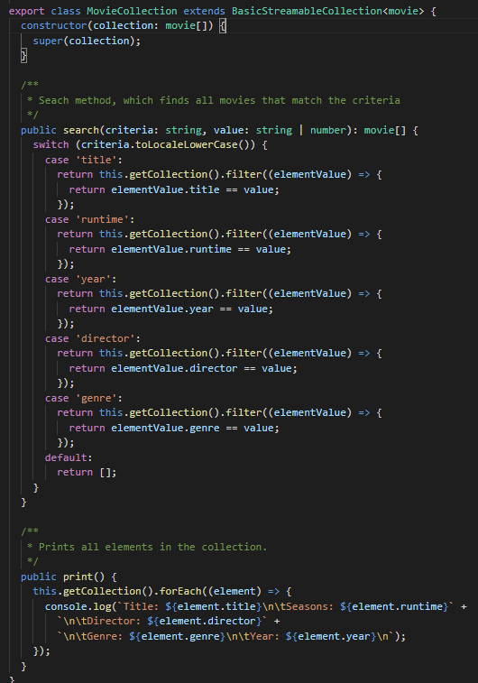

## Introducción

Práctica en donde se desarrollarán distintos problemas propuestos, o creados por el profesorado, o sacados de bancos de preguntas típicas de entrevistas de empleo a programadores, o sacados de problemas tipo de campamentos de código. 
La intencionalidad detrás de esta asignación es el desarrollo y práctica de las capacidades de los alumnos para resolver problemas y manejarse en un entorno TypeScript, en particular haciendo uso de las clases e interfaces genéricas usando los principios SOLID del diseño orientado a objetos.

## Objetivos

- Leer documentacion de Istanbul.js.
- Hacer uso de los issues de GitHub.
- Repasar los principios SOLID.
- Escribir pruebas para cada ejercicio.
- Resolver los ejercicios propuestos.
- Mantenerse dentro del ámbito de las soluciones propuestas (no utilizar elementos del lenguaje todavia no impartidos en clase).
- Elaborar un informe que explique lo realizado.
- Documentar los ejercicios.

## Tareas previas

Para tener la formacion correcta para cumplimentar los ejercicios propuestos, hacen falta tres pasos importantes:
- Leer el tutorial del [Istanbul.js](https://istanbul.js.org/).
- Leer sobre los principios [SOLID](https://samueleresca.net/solid-principles-using-typescript/).
- Montar el scaffolding del proyecto __(NPM, Node, TypeScript, ESLint, TypeDoc, Mocha, Chai, Istanbul)__.

## Ejercicio 1 - El combate definitivo

Para el desarrollo de este ejercicio, se realizo el siguiente diseño de clases de acuerdo con las siguientes tabla

||| Fighter ||| 
| - |:-:| -:| -:| -:|
|| ComicFighter || Pokemon
| DCFighter | DBFighter | MarvelFighter |

_Diseño de los luchadores_

|| Pokedex | Combat ||
| - |:-:| -:| -:| 

_Diseño de las clases no luchadoras_

Se escogio separar de esta manera los luchadores que provienen de comics tienen atributos en comun (Fecha de su primera publicacion, comic de origen) que los Pokemon no tienen. Una posible mejora seria separar dentro de los luchadores provenientes de comics los que son super heroes para no repetir el atributo RealName.

Otra decision de diseño curiosa fue como se gestionó la efectividad de los ataques.

Por una parte, esta fue la tabla:

Y esta fue la solución dentro del código.

Para testear las clases abstractas mientras se iba desarrollando se escribrieron clases Mock.

## Ejercicio 2 - Conversor de unidades

El diseño esta conformado por una clase padre base abstracta llamada Magnitude que posee el atributo value y ademas implementa la interfaz isConvertible. isConvertible implementa un metodo llamado convert, que recibe un string con el nombre de la magnitud a la que se quiere cambiar.

La solucion adoptada para las conversiones fue la siguiente:

## Ejercicio 3 - DSIflix

En este ejercicio se definen tres interfaces: Streamable, Searchable, Printable, cada una con sus diferentes utilidades, cumpliendo con el principio SOLID Interface Segregation

Luego se diseño la clase BasicStreamableCollection solicitada en el guión, implementando los métodos add y search en dicha clase pero cediendo la implementacion de search y print a cada uno de sus hijos, teniendo en cuenta que los criterios de búsqueda e impresión serán distintos para cada uno.

Por último, aquí un ejemplo de la implementacion de la clase MovieCollection, utilizando el tipo movie.

## Conclusiones

En tanto el primer como segundo ejercicio, nos encontramos con retos de diseño interesantes, que a pesar del alto tiempo que llevó construir y testear y documentar todo el código, se obtuvo la sensacion de haber practicado ampliamente.

El mayor esfuerzo lo encontramos en el ejercicio 2, en donde la tarea fue arduamente repetitiva, es decir, escribir el mismo tipo de test, compilar, escribir un código muy similar al de otras magnitudes, comprobar que los tests funcionan, y asi sucesivamente. 

## Bibliografía

Istanbul.js (s.f.). En _Istanbul.js_. Recuperado el 1` de marzo de 2021 de https://istanbul.js.org/
SOLID principles using TypeScript (s.f.). En _SamuelEresca.net_. Recuperado el 13 de marzo de 2021 de https://samueleresca.net/solid-principles-using-typescript/

